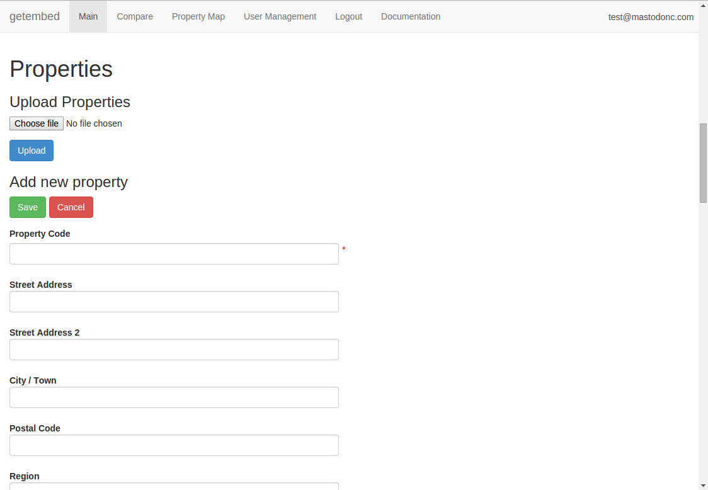

# Introduction

Embed is a system for creating programmes and projects and to track
changes to entities, such as properties over time and record sensor
data related to those entities.

# Contents

<!-- markdown-toc start - Don't edit this section. Run M-x markdown-toc/generate-toc again -->
**Table of Contents**

- [Introduction](#introduction)
- [Contents](#contents)
- [Navigation, Adding and Editing](#navigation-adding-and-editing)
    - [Advanced Search Functionality](#advanced-search-functionality)
        - [Wildcards](#wildcards)
        - [Fuzziness](#fuzziness)
        - [Proximity searches](#proximity-searches)
        - [Ranges](#ranges)
        - [Boosting](#boosting)
        - [Boolean operators](#boolean-operators)
        - [Grouping](#grouping)
        - [Reserved character](#reserved-character)
        - [Watch this space](#watch-this-space)
    - [Property Comparison](#property-comparison)
- [Programmes](#programmes)
- [Projects](#projects)
- [Properties](#properties)
    - [Uploading Property Details](#uploading-property-details)
        - [Property Details Form](#property-details-form)
            - [Important information:](#important-information)
                - [Property Code (row 3)](#property-code-row-3)
                - [Event (row 4)](#event-row-4)
                - [Timestamp (row 5)](#timestamp-row-5)
                - [Project Details Section (rows 27 to 32)](#project-details-section-rows-27-to-32)
                - [Approach / Lessons Learnt (rows 35 to 40):](#approach--lessons-learnt-rows-35-to-40)
                - [Airtightness (row 89):](#airtightness-row-89)
                - [BUS Survey (rows 92 to 103):](#bus-survey-rows-92-to-103)
                - [Row 105 Onwards (Fabric, Systems and Technologies):](#row-105-onwards-fabric-systems-and-technologies)
- [Uploading Measurements](#uploading-measurements)
- [Creating Calcuated Datasets](#creating-calcuated-datasets)
- [Creating Calculated Fields](#creating-calculated-fields)
- [User Management](#user-management)
    - [Role Permissions](#role-permissions)
        - [Programme Managers](#programme-managers)
        - [Project Managers](#project-managers)
        - [Users on a Project](#users-on-a-project)
        - [Users on a Programme](#users-on-a-programme)
    - [Editing Users](#editing-users)

<!-- markdown-toc end -->

# Navigation, Adding and Editing

Moving from programmes, to projects to properties is done by clicking
on the row in the table that gives you the over view for that
project. Clicking on the row will select that resource and scroll to
the detail.

If you have the right permissions you can add programmes, projects,
properties, devices or datasets by clicking on the + button.


If you have the permissions you can edit a resource by clicking on the
edit button.


When adding or editing resources, some fields are required. The
required fields with be marked with a red *.

## Advanced Search Functionality

The search functionality is based on elasticsearch and lucene and
provides powerful ways to create search terms.

The query string “mini-language” is used by the elasticsearch and
the search UI.

The query string is parsed into a series of terms and operators. A
term can be a single word - quick or brown - or a phrase, surrounded
by double quotes - "quick brown" - which searches for all the words in
the phrase, in the same order.

Operators allow you to customize the search - the available options
are explained below.

The following fields currently exist as searchable fields:

 * address
 * property_code
 * entity_id
 * project_team
 * project_id
 * project_code
 * property_type
 * built_form
 * age
 * address_region
 * bedroom_count (a number)
 * heating_type
 * walls_construction
 * ventilation_systems (true/false)
 * photovoltaics (true/false)
 * solar_termals (true/false)
 * wind_turbines (true/false)
 * small_hydros (true/false)
 * heat_pumps (true/false)
 * chps (true/false)

Fields can be specified like this:

```
photovoltaics:true
```

To retrieve properties with photovoltaics.

Where the built_form is either a House or a Flat

```
built_form:(House OR Flat)
```

Where the address is exactly

```
address:"Buckingham Palace, London SW1A 1AA"
```

Where the field has no value or is missing:

```
_missing_:built_form
```


Where the field property_type has any non-null value:

```
_exists_:property_type
```

### Wildcards

Wildcard searches can be run on individual terms, using ? to replace a
single character, and * to replace zero or more characters:

```
qu?ck bro*
```

Be aware that wildcard queries can use an enormous amount of memory
and perform very badly - just think how many terms need to be queried
to match the query string ```"a* b* c*"```.

Warning

Allowing a wildcard at the beginning of a word (eg "*ing") is
particularly heavy, because all terms in the index need to be
examined, just in case they match. Leading wildcards can be disabled
by setting allow_leading_wildcard to false.

Wildcarded terms are not analyzed by default - they are lowercased
(```lowercase_expanded_terms``` defaults to true) but no further
analysis is done, mainly because it is impossible to accurately
analyze a word that is missing some of its letters. However, by
setting analyze_wildcard to true, an attempt will be made to analyze
wildcarded words before searching the term list for matching terms.
Regular expression

Regular expression patterns can be embedded in the query string by
wrapping them in forward-slashes

```
("/"):
```

```
name:/joh?n(ath[oa]n)/
```

The supported regular expression syntax is explained in Regular expression syntax.
Warning

The allow_leading_wildcard parameter does not have any control over
regular expressions. A query string such as the following would force
Elasticsearch to visit every term in the index:

```
/.*n/
```

Use with caution!

### Fuzziness

We can search for terms that are similar to, but not exactly like our
search terms, using the “fuzzy” operator:

```
quikc~ brwn~ foks~
```

This uses the Damerau-Levenshtein distance to find all terms with a
maximum of two changes, where a change is the insertion, deletion or
substitution of a single character, or transposition of two adjacent
characters.

The default edit distance is 2, but an edit distance of 1 should be
sufficient to catch 80% of all human misspellings. It can be specified
as:

```
quikc~1
```

### Proximity searches

While a phrase query (eg "john smith") expects all of the terms in
exactly the same order, a proximity query allows the specified words
to be further apart or in a different order. In the same way that
fuzzy queries can specify a maximum edit distance for characters in a
word, a proximity search allows us to specify a maximum edit distance
of words in a phrase:

```
"fox quick"~5
```

The closer the text in a field is to the original order specified in
the query string, the more relevant that document is considered to
be. When compared to the above example query, the phrase "quick fox"
would be considered more relevant than "quick brown fox".

### Ranges

Ranges can be specified for date, numeric or string fields. Inclusive
ranges are specified with square brackets [min TO max] and exclusive
ranges with curly brackets {min TO max}.

Properties with 1-3 bedrooms

```
bedrooms:[1 TO 3]
```

Ranges with one side unbounded can use the following syntax:

    bedrooms:>10
    bedrooms:>=10
    bedrooms:<10
    bedrooms:<=10

Note

To combine an upper and lower bound with the simplified syntax, you
would need to join two clauses with an AND operator:


    bedrooms:(>=10 AND < 20)
    bedrooms:(+>=10 +<20)

### Boosting

Use the boost operator ^ to make one term more relevant than
another. For instance, if we want to find all documents about foxes,
but we are especially interested in quick foxes:

```
quick^2 fox
```

The default boost value is 1, but can be any positive floating point
number. Boosts between 0 and 1 reduce relevance.

Boosts can also be applied to phrases or to groups:

```
"john smith"^2   (foo bar)^4
```

### Boolean operators

By default, all terms are optional, as long as one term matches. A
search for foo bar baz will find any document that contains one or
more of foo or bar or baz. We have already discussed the
default_operator above which allows you to force all terms to be
required, but there are also boolean operators which can be used in
the query string itself to provide more control.

The preferred operators are + (this term must be present) and - (this
term must not be present). All other terms are optional. For example,
this query:

```
quick brown +fox -news
```

states that:

 * fox must be present
 * news must not be present
 * quick and brown are optional - their presence increases the relevance

The familiar operators AND, OR and NOT (also written &&, || and !) are
also supported. However, the effects of these operators can be more
complicated than is obvious at first glance. NOT takes precedence over
AND, which takes precedence over OR. While the + and - only affect the
term to the right of the operator, AND and OR can affect the terms to
the left and right.

### Grouping

Multiple terms or clauses can be grouped together with parentheses, to
form sub-queries:

```
(quick OR brown) AND fox
```

Groups can be used to target a particular field, or to boost the
result of a sub-query:

```
property_type:(flat OR house) title:(full text search)^2
```

### Reserved character

If you need to use any of the characters which function as operators
in your query itself (and not as operators), then you should escape
them with a leading backslash. For instance, to search for ```(1+1)=2```,
you would need to write your query as ```\(1\+1\)=2```.

The reserved characters are: ```+ - && || ! ( ) { } [ ] ^ " ~ * ? : \ /```

Failing to escape these special characters correctly could lead to a
syntax error which prevents your query from running.

### Watch this space

A space may also be a reserved character. For instance, if you have a
synonym list which converts "wi fi" to "wifi", a query_string search
for "wi fi" would fail. The query string parser would interpret your
query as a search for "wi OR fi", while the token stored in your index
is actually "wifi". Escaping the space will protect it from being
touched by the query string parser: "wi\ fi".


## Property Comparison

Property Comparison tab allows you to compare sensor readings between
multiple properties. You can only compare properties that you have
permission to see. To search for a property, please enter its code,
address or other indentifying information into the search box:


Next, select a property you want to use for comparison from the list
of all found properties. That property will be moved to the Selected
Properties table. To select another property, search and select it the
same way. To remove the property from your selection, click on it in
the Selected Properties table.


Sensor table shows all available sensors from selected
properties. In order to plot their readings on the chart below, select
the ones you are interested in by clicking on them. You can only
select maximum two different sensor units - appropriate warning will
be displayed if you try to select too many different units.


Once you are happy with your selections, click on Chart Data
button. Readings will be retrieved from the database and displayed on
the chart.


You can go back to selecting/de-selecting properties and sensors at
any time.

# Programmes

Programmes allow you to have multiple projects in with one overview
and leadership team. Project Managers and users on projects can only
see data in their projects, allowing for privacy between project teams,
but an overview for the programme team.

# Projects

Projects are a way of getting people together to work on a group of
properties. All data in a project are editable by a programme or
project manager. Users in a project can view all private data in that
project.

# Properties

## Uploading Property Details

You can upload a csv file to create a property with profile
details.



To make it easier to create the csv an Excel template has been
created. To use it, fill in the Excel spreadsheet as below and save
the file as csv when you are done. The csv can be uploaded as in the
picture above.

### Property Details Form

[This Excel spreadsheet](example-property.xlsx) has been designed to
comprehensively capture the diverse range of building characteristics
(house type, construction, technologies installed); plus overview info
on the initial design intention and final output. The information in
this form will be fed directly into the Embed database associated with
each dwelling with the intention of giving external parties a clear
view on the home, technologies installed and the intended/achieved
performance.

Information is required from the dwelling as designed, and from the
dwelling as built, as these specifications may be different. There are
also opportunities to add interventions that identify times when the
performance of the dwelling may change. This could be an intervention
in the fabric, service or a change in occupation.

There are many data fields for completion, but not all will be
relevant to your study building(s). Please attempt to complete all
relevant fields to the best of your ability.

As far as is possible fields have been pre-populated with information
for you to select, however we fully expect there to be omissions and
encourage the giving of additional info in boxes that request either
'specify or give further information' boxes. These fields should only
be used for giving clarifications - any narrative in relation to
changes in specifications and the reasons for change, or unexpected
challenges arising from the project must be captured in detail on the
final reporting template document that accompanies this workbook.

Some cells have comments boxes that contain further information and
guidance. These are identified by a small red tag in the top right
corner of the cell.

#### Important information:

This workbook collects information from a single property in your
study. A different datasheet must be completed for each property being
physically monitored. If dwellings are similar then the workbook can
be duplicated with relevant amends made to the information
contained. Sheets do not need to be completed for those dwellings that
are having qualitative assessments only.

Most parts of the workbook should be self-explanatory. Every data
entry cell will prompt for the information required though a pop-up
box, which will appear when the cell is active. If there is any
uncertainty when attempting to answer questions, or what units /
metrics are required when completing values, please follow SAP
conventions and clarify using the 'specify or give further
information' boxes.

There are five types of data entry cell:

* Free numeric field = please put in a number. There is no need to put
  the metric for that number (e.g. %, m, kWh).
* Date = please input the date required in the format dd/mm/yyyy
  unless otherwise stated (all date cells should be preformatted to
  dd/mm/yyyy)
* Please select = these are dropdown lists that have been
  pre-populated. Some dropdown lists have the opportunity to select
  "Other (please specify)". For reasons of accurate categorisation
  please only use "other" as a last resort if the supplied definitions
  are totally inappropriate. When choosing "Other (please specify)"
  please always categorise the other solution utilised in the space
  provided.
* Free text field = please type your answer; there should not be a
  limit to the amount of text you can enter. In free text boxes please
  press Alt+Return for a new line.
* Specify or give further information = If you have chosen "other" as
  an option please specify here, or give further information. Please
  keep comments brief and relevant to the row question.

There are some cells that require more specific information and
guidance is given below

##### Property Code (row 3)

Please use a name / code to identify this property. This should be the
same name / code that you have been using to describe this property
throughout the reporting process and my be in the form of "plot x" or
"dwelling y". You should avoid using real property names / numbers to
protect the personal information of participants as the property code
will be visible if the programme is made public.

Use the same property code for create, as designed, as built and any
interventions to identify which property the data relates to.

For circumstances where you have more than one property you can use
multiple workbooks. But remember to use a different property code,
consistent with your reporting, to identify it as a different
property.

##### Event (row 4)

We are collecting information on different stages of the build and
Embed has four "event types" to achieve this:

* Create: takes static information about the property that does not
  change (e.g. address, dwelling type, location, project and
  property). From the dropdown select create and enter information
  from the area highlighted in blue only.
* As designed: takes information from the design stage of the
  development. Please complete the boxes in white as completely as
  possible.
* As built: represents the final dwelling characteristics. Information
  can be copied from the "as designed" column but care must be taken
  to ensure that all the fields are revised to reflect the building
  that was actually completed.
* Intervention: if any changes have been made to the dwelling
  (e.g. remedial works to the fabric, re-commissioning of services or
  a change in occupation) this should be specified in a new column
  classified as an intervention. The intervention must be dated as
  accurately as possible as this allows us to make better calculations
  with the measurements against the profile data and better
  comparisons among properties.

##### Timestamp (row 5)

This is needed primarily for tracking intervention dates, but the
system requires a date for create, as designed and as built. For ease
use the BPE contract end date for the "create" value, use the
approximate date when the original designs were drawn-up for the
"as designed" value, and the approximate date for when the development
started for the "as built" value.

##### Project Details Section (rows 27 to 32)

The responses to these questions should be reasonably brief but
informative and have a proper sentence structure to give context to
the project.

##### Approach / Lessons Learnt (rows 35 to 40):

There are two responses required for these items. For the "as
designed" information please outline the intentions and approach. For
the "as built" information please respond from the position of lessons
learnt. As above the responses to these questions should be reasonably
brief but informative and have a proper sentence structure.

##### Airtightness (row 89):

Add the target airtightness at design stage in the "as designed" value
column.  For the BPE mandatory airtightness test (Phase 1 and 2
studies) add this to the "as built" column.  For the 2nd airtightness
test (carried out at the end of Phase 2 studies only) create a new
intervention and add the airtightness test result in the intervention
column

##### BUS Survey (rows 92 to 103):

Please give the BUS result between 1 and 7. This is taken from the BUS
Summary (overall variables table) which was supplied by Arup. Please
complete this for "as built" only.  If a second BUS has been
undertaken please add this as an intervention

##### Row 105 Onwards (Fabric, Systems and Technologies):

Generally we are expecting a response for each technology present and
the predominant performance values for fabric elements. However there
may be some circumstances where there are multiple elements / systems
/ technologies present (e.g. heating and hot water systems). If this
is the case then the relevant rows can be duplicated, ensuring that
the primary system comes first.

# Uploading Measurements

The preferred way to enter measurements into the system is via the
AMON API. If you have legacy data to upload that is already in or can
be converted to csv then those can be uploaded too.


Measurements csvs can either be downloaded in the canonical format, or
you can create aliases for the headers for each sensor.


and then click on Assume Aliases


Upload statuses are shown on the same page. Errors are listed on the
same page.


CSV files must be uploaded one at a time, but multiple csv files can
be processed at once, so you do not have to wait for processing can
finish. If a file fails to upload, or if some sensors haven't uploaded
correctly, you can fix any issues and just reupload the
file. Re-uploading the file overwrites the previous data.

# Creating Calcuated Datasets

If you have the permissions, embed allows you to create a calculated
dataset. Calculated datasets are where you can take 2 or more datasets
and either

* sum a number of series
* subtract series one from another
* divide one series by another
* divide a series by a field
* multiply a series by a field


The available fields are:

* Total Occupancy
* Total Volume
* Total Area
* Electricity Cost
* Gas Cost


Fields are held on the profiles for the property in question.

Each calculated dataset creates a new dataset that can become part of
a new calculation. This allows you to chain calculations together so
you can for example sum a number of electricity usage meters and then
divide that by another value such as external temperature.

There are a few restrictions on what calculations are possible.

For Sums and Subtract, the combined series can be

* Cumulative and Pulse
* Cumulative and Cumulative
* Pulse and Pulse

But you cannot combine

* Cumulative and Instant
* Pulse and Instant

You can however, divide any one series by another.

Currently, the other restriction is that series must have a matching
resolution (such as all being 300 seconds).

# Creating Calculated Fields

For every sensor, you can create an overall calculation for the last
12 months of sensor data by clicking on the Calculated Field tick box
on the sensor.


# Automatically created synthetic sensors

There is a number of synthetic sensors that are automatically created
when a new sensor is created.

Synthetic sensors based on the period:
- CUMULATIVE - triggers creation of difference series sensor and
automatic calculation of difference series for that sensor
- INSTANT - no synthetic sensor is created.
- PULSE - triggers creation of a synthetic sensor that is based on the
original unit of the sensor. Details are described below.

Synthetic sensors based on the unit:
- kWh - triggers creation of co2 sensor and automatic calculation of
kWh measurements to co2.
- m^3 - triggers creation of kWh sensor and automatic calculation of
m^3 measurements to kWh.
- ft^3 - triggers creation of kWh sensor and automatic calculation of
ft^3 measurements to kWh.

If sensor's unit or period has been changed by the user, appropriate
synthetic sensors will be updated/deleted/created automatically.

Synthetic sensors are flagged as such on both the UI and in the
response from the API. Type of each sensor is created by appending
appropriate keyword to the original type, e.g.

type: electricityConsumption period: CUMULATIVE unit: kWh
becomes:
type: electricityConsumption_differenceSeries period: PULSE unit: kWh

type: gasConsumption period: PULSE unit: kWh
becomes:
type: gasConsumption_co2 period: PULSE unit: co2

type: gasConsumption period: PULSE unit: ft3
becomes:
type: gasConsumption_kwh period: PULSE unit: kwh

type: gasConsumption_kwh period: PULSE unit: kwh
becomes:
type: gasConsumption_kwh_co2 period: PULSE unit: co2

# User Management

Click on the User Management Tab to see the User Management
screen. This allows you to search for any user in the system by their
registered email address and add them to any programmes or projects
that you are a programme manager or project manager for.


## Role Permissions

### Programme Managers

Programme managers can do the following:

* Edit programme details
* Add, edit, delete projects in their programme
* Add, edit, delete entities and related data in projects in their
  programmes
* Upload measurements data
* Create new calculated datasets

### Project Managers

Project managers can do the following:

* Edit project details
* Add, edit, delete entities and related data in their project
* Upload measurements data
* Create new calculated datasets

### Users on a Project

* View all data, public and private on that project

### Users on a Programme

* View all data, public and private on that programme

## Editing Users

If you are an administrator you can set the overall role for a user as
User, Admin or Super Admin. If you are not an administrator but are a
programme or project manager, then you can make a user into a
programme manager, project manager or user on any programme or project
you manage.

All managers and administrators have rights to edit data in programmes
or projects they have been added to. These rights cascade down into
the projects, properties, devices etc contained in the programme or
project they are a manager for.

All users have the right to view private data in the programmes or
projects they have been added to.


Here is an example of making a user a programme manager.


This is what it looks like when you have successfully edited a user.


