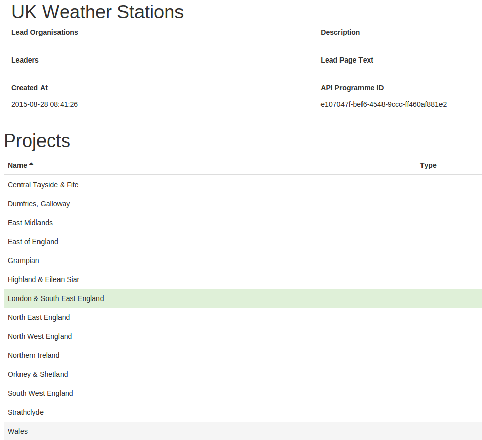
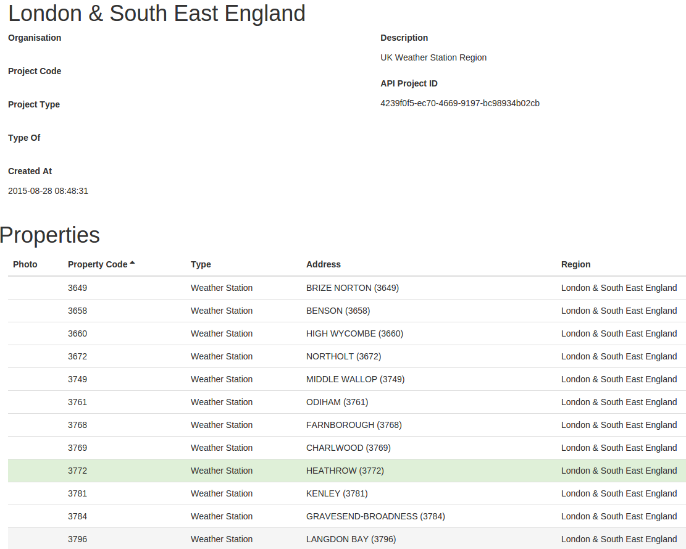

#Tapestry documentation

## Sensor aliasing

1) Get the device/sensor ids for a weather station

* Inside the "UK Weather Stations" programme select a region and a weather station

* Copy the device id and a sensor id

2) Add a new device in the property

3) Associate the property and the weather station

## Tapestry charts

## x/y plots
