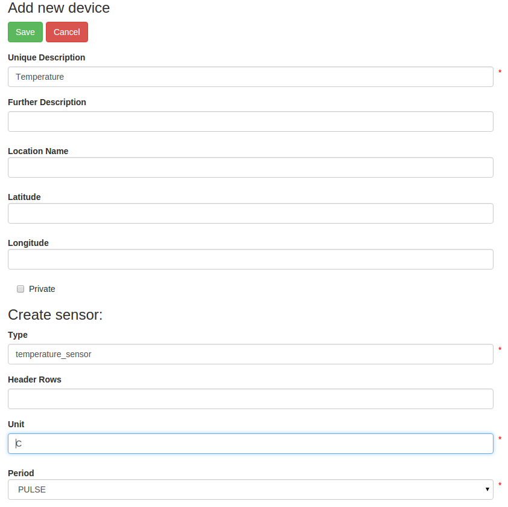
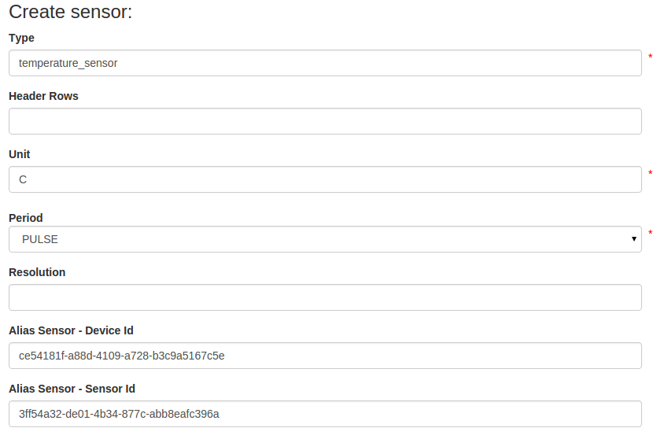

#Tapestry documentation

## Sensor aliasing

1) Get the device/sensor ids for a weather station

* Select a weather station

Inside the "UK Weather Stations" programme select a region:

Inside this region, select a weather station:

* Copy the device id and "degree day" sensor id:

2) Add a new device in the property

In your property of interest, create a new device:

3) Associate the property and the weather station

Link the device with a weather station by adding an alias:

## Tapestry charts

For a property, select the "Tapestry Charts" tab and click on the device of interest:

## x/y plots
