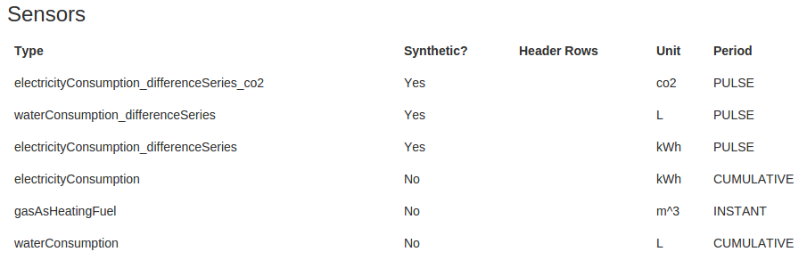

## A guide to using the Embed API

last updated on 26 Jan 2016
<br>

### Content

* [General information](#general-information)
* [GET request example](#get-request-example)
* [Programmes](#programmes)
* [Projects](#projects)
* [Properties](#properties)
* [Devices](#devices)
* [Sensors](#sensors)
* [Measurements](#measurements)
* [Advanced GET request](#advanced-get-request)
* [Example of use](#example-of-use)

<br>

### General information

The API resources are composed of:

**Programmes** > **Projects** > **Entities** (= properties) > **Devices** > **Sensors** > **Measurements**

<br>

-> For full API documentation, see [here](https://github.com/MastodonC/kixi.hecuba/blob/master/doc/api.md),

-> For more detailed code examples see [here](https://github.com/MastodonC/scripts-embed-api)


__Important notes: 
1) In the examples below, any text surrounded by `<-` and `->` should be replaced by an actual value.
2) Simple queries for programmes, projects and devices will return a maximum of 50 results. For more results use the ["Advanced GET request"](#advanced-get-request).
3) The code example in this document are written in Python 2.7. They may need adjusting for Python 3.__


### GET request example

*Note: 
You will need to register on [getEmbed](http://www.getembed.com/) to get your user credentials: your `username` (the email address you used to sign up) and your `password`.*

**Here's a basic GET request in Python:**

Replace `username` and `password` by your own credentials.
Depending on the info you want to retrieve you will have to modify the `url`. The basic url being "https://www.getembed.com/4/".

```Python
import sys
import requests
from requests.auth import HTTPBasicAuth

auth = HTTPBasicAuth(username, password)
try:
    r = requests.get(url=url, auth=auth)
    if r.status_code == requests.codes.ok:
        print ">> Your http request was accepted! =)"
        return r.json()
    else:
        print ">> Something went wrong! :-/"
        r.raise_for_status()
except requests.exceptions.ConnectionError as e:
    print ">> Connection error: ", e.message
except requests.exceptions.Timeout as e:
    print ">> Connection timed out: ", e.message
except requests.exceptions.HTTPError as e:
    print ">> HTTP error: ", e.message
except requests.exceptions.RequestException as e:
    print ">> Request exception: ", e.message
    sys.exit()
```

### Programmes

* #### Get all programmes:

  Update the code above with:

  `url` = "https://www.getembed.com/4/programmes/"

  
  Example of response:
```json
[
    {
      "created_at": "2014-08-20 15:56:19",
      "href": "/4/programmes/c94a2f01d89708fb406fed83665ccb1c36e441a5",
      "updated_at": "2014-08-20 15:56:19",
      "leaders": null,
      "programme_id": "",
      "name": "A programme name",
      "lead_organisations": "An organisation",
      "home_page_text": "Some text",
      "public_access": "true",
      "lead_page_text": null,
      "projects": "/4/programmes/c94a2f01d89708fb406fed83665ccb1c36e441a5/projects/",
      "description": "Some more text"
    }
]
```


* #### Get one programme:

  You will need the `programme_id`. It can be found in the reponse after requesting all programmes. 
  Edit the code example with:

  `url` = "http://localhost:8010/4/programmes/<-**programme_id**->"
 
  For the Building Performance Evaluation (BPE) programme the `programme_id` is `bfb6e716f87d4f1a333fd37d5c3679b2b4b6d87f`.
  
  You can then use:
 
  `url` = "https://www.getembed.com/4/programmes/bfb6e716f87d4f1a333fd37d5c3679b2b4b6d87f"
  
   Example of response:
```json
{
    "description": null,
    "projects": "/4/programmes/9b7ff9c2-f82f-4528-9934-c72eba3bb8fd/projects/",
    "lead_page_text": null,
    "public_access": null,
    "home_page_text": null,
    "lead_organisations": null,
    "admin": true,
    "editable": true,
    "name": "TEST102",
    "programme_id": "9b7ff9c2-f82f-4528-9934-c72eba3bb8fd",
    "leaders": null,
    "updated_at": null,
    "created_at": null
}
```


### Projects

* #### Get all projects in a programme:

  You will need the `programme_id` (see above).
  Edit the code example with:

  `url` = "http://www.getembed.com/4/programmes/<-**programme_id**->/projects"

  Example of response:

```json
[
    {
        "description": null,
        "properties": "/4//",
        "organisation": null,
        "name": "TESTPROJECT",
        "programme_id": "9b7ff9c2-f82f-4528-9934-c72eba3bb8fd",
        "project_type": null,
        "updated_at": null,
        "type_of": null,
        "project_id": "8e9972b9-a90f-44bc-89ce-2bb7b2b281ab",
        "project_code": null,
        "href": "/4/programmes/9b7ff9c2-f82f-4528-9934-c72eba3bb8fd/projects/8e9972b9-a90f-44bc-89ce-2bb7b2b281ab",
        "created_at": null
    }
]
```


* #### Get one project:

  You will need the `programme_id` (see above) and the `project_id`. 
  The `project_id` can be found in the reponse after requesting all projects.
  Edit the code example with:

  `url` = "http://www.getembed.com/4/programmes/<-**programme_id**->/projects/<-**project_id**->"

  Example of response:
```json
{
    "description": null,
    "organisation": null,
    "name": "TESTPROJECT",
    "programme_id": "9b7ff9c2-f82f-4528-9934-c72eba3bb8fd",
    "project_type": null,
    "updated_at": null,
    "type_of": null,
    "project_id": "8e9972b9-a90f-44bc-89ce-2bb7b2b281ab",
    "project_code": null,
    "created_at": null
}
```

### Properties

*Note: 
Properties on getEmbed are included in the "entities".
Later we'll talk about `entity_id` for example (but they also have a `property_code`).*


* #### Get all properties in a project:
  You will need the `project_id` (see above).
  Edit the code example with:
  `url` = "http://www.getembed.com/4/projects/<-**project_id**->/entities"

  Example of response:

```json
{
    "total_hits": 2,
    "page": 0,
    "entities": [
        {
            "public_access": null,
            "editable": true,
            "programme_name": "AAA Programme",
            "property_code": "PROP01",
            "programme_id": "9b7ff9c2-f82f-4528-9934-c72eba3bb8fd",
            "documents": [],
            "photos": [],
            "devices": [],
            "profiles": [],
            "entity_id": "2d7d6785-d3d2-4c98-9de9-b5a92fd27a82",
            "project_id": "8e9972b9-a90f-44bc-89ce-2bb7b2b281ab",
            "project_name": "My Project"
        }...
    ]
}
```

* #### Get one property:

  You will need the `entity_id`. It can be found in the reponse after requesting all properties.
  Edit the code example with:
  `url` = "http://www.getembed.com/4/entities/<-**entity_id**->"

  Example of response:

```json
{
    "public_access": null,
    "editable": true,
    "programme_name": "AAA Programme",
    "property_code": "PROP01",
    "programme_id": "9b7ff9c2-f82f-4528-9934-c72eba3bb8fd",
    "documents": [],
    "photos": [],
    "devices": [],
    "profiles": [],
    "entity_id": "2d7d6785-d3d2-4c98-9de9-b5a92fd27a82",
    "project_id": "8e9972b9-a90f-44bc-89ce-2bb7b2b281ab",
    "project_name": "My Project"
}
```

### Devices

* #### Get all devices in a property:

  You will need the `entity_id` (see above).
  Edit the code example with:
  `url` = "https://www.getembed.com/4/entities/<-**entity_id**->/devices/"

  Example of response:
```json
[
    {
        "description": "Utility Meters",
        "readings": [
            {
                "min": null,
                "unit": "kWh",
                "user_metadata": null,
                "accuracy": "0.1",
                "sensor_id": "6fbcadc9-1726-44dc-9896-01d30d7c5719",
                "frequency": null,
                "corrected_unit": null,
                "type": "electricityConsumption_differenceSeries",
                "correction_factor": null,
                "upper_ts": null,
                "correction": null,
                "resolution": "60",
                "alias": null,
                "median": 0.0,
                "status": null,
                "max": null,
                "lower_ts": null,
                "correction_factor_breakdown": null,
                "period": "PULSE",
                "synthetic": true,
                "device_id": "cf62ea45-7cf8-431b-9bdc-265ad5a42d01",
                "actual_annual": false
            },
            {
                "min": null,
                "unit": "kWh",
                "user_metadata": {
                    "foo": "bar"
                },
                "accuracy": "0.1",
                "sensor_id": "b09e97fc-1e16-4609-bf7f-b28730845c69",
                "frequency": null,
                "corrected_unit": null,
                "type": "electricityConsumption",
                "correction_factor": null,
                "upper_ts": null,
                "correction": null,
                "resolution": "60",
                "alias": null,
                "median": 0.0,
                "status": null,
                "max": null,
                "lower_ts": null,
                "correction_factor_breakdown": null,
                "period": "CUMULATIVE",
                "synthetic": false,
                "device_id": "cf62ea45-7cf8-431b-9bdc-265ad5a42d01",
                "actual_annual": false
            }
        ],
        "editable": true,
        "name": null,
        "privacy": null,
        "metering_point_id": null,
        "parent_id": null,
        "entity_id": "2d7d6785-d3d2-4c98-9de9-b5a92fd27a82",
        "synthetic": false,
        "device_id": "cf62ea45-7cf8-431b-9bdc-265ad5a42d01",
        "location": null,
        "metadata": null
    }
]
```


* #### Get one device:
  You will need the `entity_id` (see above) and the `device_id`. 
  The `device_id` can be found in the reponse after requesting all devices.
  Edit the code example with:

  `url` = "https://www.getembed.com/4/entities/<-**entity_id**->/devices/<-**device_id**->"

  Example of response:
```json
{
    "description": "Utility Meters",
    "readings": [
        {
            "min": null,
            "unit": "kWh",
            "user_metadata": null,
            "accuracy": "0.1",
            "sensor_id": "6fbcadc9-1726-44dc-9896-01d30d7c5719",
            "frequency": null,
            "corrected_unit": null,
            "type": "electricityConsumption_differenceSeries",
            "correction_factor": null,
            "upper_ts": null,
            "correction": null,
            "resolution": "60",
            "alias": null,
            "median": 0.0,
            "status": null,
            "max": null,
            "lower_ts": null,
            "correction_factor_breakdown": null,
            "period": "PULSE",
            "synthetic": true,
            "device_id": "cf62ea45-7cf8-431b-9bdc-265ad5a42d01",
            "actual_annual": false
        },
        {
            "min": null,
            "unit": "kWh",
            "user_metadata": {
                "foo": "bar"
            },
            "accuracy": "0.1",
            "sensor_id": "b09e97fc-1e16-4609-bf7f-b28730845c69",
            "frequency": null,
            "corrected_unit": null,
            "type": "electricityConsumption",
            "correction_factor": null,
            "upper_ts": null,
            "correction": null,
            "resolution": "60",
            "alias": null,
            "median": 0.0,
            "status": null,
            "max": null,
            "lower_ts": null,
            "correction_factor_breakdown": null,
            "period": "CUMULATIVE",
            "synthetic": false,
            "device_id": "cf62ea45-7cf8-431b-9bdc-265ad5a42d01",
            "actual_annual": false
        }
    ],
    "name": null,
    "privacy": null,
    "metering_point_id": null,
    "parent_id": null,
    "entity_id": "2d7d6785-d3d2-4c98-9de9-b5a92fd27a82",
    "synthetic": false,
    "device_id": "cf62ea45-7cf8-431b-9bdc-265ad5a42d01",
    "location": null,
    "metadata": null
}
```

### Sensors

#### Device sensors
Each device can have several sensors:

The example response above includes a sub-element called `"readings"`. Each item in `"readings"` represent information for one sensor of this device.


#### Sensors types and units
Each sensor has a `type` that will be used to retrieve measurements. This `type` describes the sensor's function. It can be monitoring electricity consumption, gas consumption, temperature... Depending on the `type` a sensor will have a specific `unit` (example: kWh = kilowatt hours, L = litres, m^3 = cubic metres...). 


#### Sensors periods
Measurements values for each sensor have one of those three periods:

* `INSTANT`: measurement value at a specific time
* `PULSE`: value equal to the difference between the measurement at a specific time and the last measurement
* `CUMULATIVE`: value equal to the accumulation of measurements over time (like a gas or electric metre)


#### "Synthetic" sensors
Some sensor have raw measurements. Those sensors are considered "non-synthetic" and information about those sensors will include `"synthetic": false` (see example of device query response above).
Other sensors are considered "synthetic" and information on those sensors will include `"synthetic": true`. Those sensors have measurements that results from calculations (happening in regularly in the background). 
The type of calculations done on the raw measurements will be reflected on the sensor `type`. From the screenshot above you can see "synthetic" sensors have `_differenceSeries` or `_differenceSeries_CO2` appended to the type a corresponding "non-synthetic" sensor.


#### Calculations
**Difference-series** are associated with the presence of `_differenceSeries` in the sensor `type`. 
They are calculations between two measurements done for sensors of `period` set as `CUMULATIVE` to be converted to `PULSE`.

**Conversions** are associated to the presence of `_CO2` or `_kWh` in the sensor `type`.
They are triggered automatically depending on the sensor `unit`:

* sensors of `unit` m^3 or ft^3 are converted to kWh
* sensors of type kWh are converted to CO2


### Measurements

*Note: 
There are three types of measurements you can retrieve: __raw measurements__, __hourly rollups__ and __daily rollups__.
Rollups are operations happening behind the scene at regular intervals.
The two types of rollups are the results of aggregating the raw measurements per hour or per day.*

Edit the code example with:

`url` = "https://www.getembed.com/4/entities/<-**entity_id**->/devices/<-**device_id**->/<-MEASUREMENTS->/<-**type**->?startDate=<-START->&endDate=<-END->"

where:
    - `entity_id` and `device_id` are refered to in previous paragraph
    - `MEASUREMENTS` is either `measurements`, `daily_rollups` or `hourly_rollups`
    - `type` is the sensor type (see above, it can be found when requesting info for a specific device)
    - `START` is the formatting of the start date and start time like `2014-01-23%2000:00:00`
    - `END` is the formatting of the end date and end time like `2014-01-24%2000:00:00`
    
Example of response:

```json
{"measurements": 
    [
        {
            "timestamp": "2013-07-01T00:00:00+0000", 
            "sensor_id": "ab6aabda-9e27-4b01-99a7-d2322c4733fa", 
            "value": "0.8999999999999773"
        }, 
        {
            "timestamp": "2013-07-02T00:00:00+0000", 
            "sensor_id": "ab6aabda-9e27-4b01-99a7-d2322c4733fa", 
            "value": "1.0"
        }, 
        {
            "timestamp": "2013-07-03T00:00:00+0000", 
            "sensor_id": "ab6aabda-9e27-4b01-99a7-d2322c4733fa", 
            "value": "0.9000000000000057"
        }, 
        {
            "timestamp": "2013-07-04T00:00:00+0000", 
            "sensor_id": "ab6aabda-9e27-4b01-99a7-d2322c4733fa", 
            "value": "0.9000000000000057"
        }, 
        {
            "timestamp": "2013-07-05T00:00:00+0000", 
            "sensor_id": "ab6aabda-9e27-4b01-99a7-d2322c4733fa", 
            "value": "0.9000000000000057"
        }, 
        {
            "timestamp": "2013-07-06T00:00:00+0000", 
            "sensor_id": "ab6aabda-9e27-4b01-99a7-d2322c4733fa", 
            "value": "1.0"
        }, 
        { 
            "timestamp": "2013-07-07T00:00:00+0000", 
            "sensor_id": "ab6aabda-9e27-4b01-99a7-d2322c4733fa", 
            "value": "1.0"
        }, 
        {
            "timestamp": "2013-07-08T00:00:00+0000", 
            "sensor_id": "ab6aabda-9e27-4b01-99a7-d2322c4733fa", 
            "value": "0.9000000000000057"
        }, 
        {
            "timestamp": "2013-07-09T00:00:00+0000", 
            "sensor_id": "ab6aabda-9e27-4b01-99a7-d2322c4733fa", 
            "value": "1.0999999999999943"}, 
        {
            "timestamp": "2013-07-10T00:00:00+0000", 
            "sensor_id": "ab6aabda-9e27-4b01-99a7-d2322c4733fa", 
            "value": "1.0"
        }
    ]
}
```


### Advanced GET request

You can customise searches by creating slightly more complex url for a GET request.

Example of url:

Get entities in a specific project and with a particular `property_code`: 

`url` = "https://www.getembed.com/4/entities/?q=project_id%3A<-**project_id**->%20AND%20property_code%3A<-**property_code**->&page=0&size=10&sort_order=asc"

where the `property_code` is a string of character asigned when adding the property to getEmbed. It shouldn't be confused with the property unique identifier which is its `entity_id`.


Read [this](https://github.com/MastodonC/kixi.hecuba/blob/master/doc/help/embed.md#advanced-search-functionality) to learn more about this functionality and see which fields are searchable.


### Example of use

I'm looking at whole house electricity consumption for a property in the Building Performance Evaluation (BPE) programme.
I choose to request daily rollups for the first month of available data. I print out a list of the measurement values as well as the minimum, maximum and average value.

Reminder: 
Replace `username` and `password` by your own credentials obtained after creating an account on [getEmbed](http://www.getembed.com/).

```json
#!/usr/bin/python
import sys
import requests
from requests.auth import HTTPBasicAuth


property_id = "e7cf18577c4eb7a72cb0e80f2aaec97d91cccc4a"
device_id = "8b0577abc8959173b528bd101a7536fdf6e9ace6"
start_date = "2013-07-01%2000:00:00"
end_date = "2013-08-01%2000:00:00"

url = "https://www.getembed.com/4/entities/" + property_id +  "/devices/" + \
      device_id + "/daily_rollups/electricityConsumption?startDate=" + \
      start_date + "&endDate=" + end_date


def get_embed_data(username, password, url):
    """Send HTTP GET request to the getEmbed API 
    and return data in json format."""
    auth = HTTPBasicAuth(username, password)
    ## Try a GET request and return the data in json format
    try:
        r = requests.get(url=url, auth=auth)
        if r.status_code == requests.codes.ok:
            print ">> Your http request was accepted! =)"
            return r.json()
        else:
            print ">> Something went wrong! :-/"
            r.raise_for_status()
    except requests.exceptions.ConnectionError as e:
        print ">> Connection error: ", e.message
    except requests.exceptions.Timeout as e:
        print ">> Connection timed out: ", e.message
    except requests.exceptions.HTTPError as e:
        print ">> HTTP error: ", e.message
    except requests.exceptions.RequestException as e:
        print ">> Request exception: ", e.message
        sys.exit()
    

if __name__ == "__main__":
    # Save code in a file and run on the command line like:
    # python embed-test-api.py user@gmail.com my-Password
    
    embed_data = get_embed_data(sys.argv[1], sys.argv[2], url)
    list_values = [float(data["value"]) for data in embed_data["measurements"]]
    print "List of measurements: ", list_values
    print "Minimum value: ", min(list_values)
    print "Maximum value: ", max(list_values)
    print "Average value: ", sum(list_values) / len(list_values)

```
